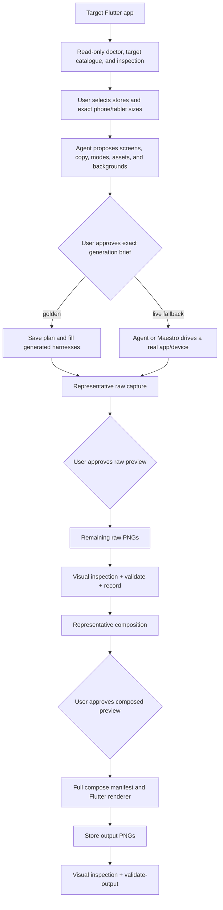

# How Flutter App Shots Works

This is an implementation-backed walkthrough of the `flutter-app-shots` skill
pack as it exists in this repository. It explains what happens
when the skill is selected, which work belongs to the agent, which work is done
by the bundled Dart and Flutter packages, what files cross each boundary, and
where the current implementation stops.

The shorter [`SKILL.md`](SKILL.md) is the operational instruction set an agent
follows. This document is the companion mental model for a human who wants to
understand, run, maintain, or debug the pack.

For local Codex setup, symlink installation, verification, updates, and
uninstall instructions, see [`INSTALLATION.md`](INSTALLATION.md).

## The result

The pack turns real Flutter screens into store-ready PNGs by using Flutter
twice:

1. A generated widget-test harness renders the target app's real screen widgets
   into raw screenshots at store-native pixel sizes.
2. A separate Flutter renderer places those screenshots inside deterministic
   device frames, adds approved copy, paints a background, and writes the final
   App Store or Play Store image.

An image model may generate a background asset only. It never generates the app
UI, device frame, headline, subheadline, logo, or product claim.

There is deliberately no single `generate-everything` command. Product choices,
source inspection, mock-data authoring, asset curation, user confirmations, and
visual review require an agent or human. Repeatable mechanics are delegated to
the CLI and renderer.

## The four parts of the pack

| Part | Role | Important entry point |
| --- | --- | --- |
| Skill instructions | Tells the agent when to use the pack and the order, gates, and quality rules it must follow | [`SKILL.md`](SKILL.md) |
| Dart tool | Checks prerequisites; validates plans, copy, captures, and outputs; scaffolds capture tests; normalizes composition specs; records regeneration metadata | [`tool/bin/app_shots.dart`](tool/bin/app_shots.dart) |
| Flutter renderer | Paints backgrounds, frames, typography, and layouts into exact-size PNGs | [`renderer/test/compose_test.dart`](renderer/test/compose_test.dart) |
| Fixture app | A small target Flutter app used to exercise capture and composition end to end | [`fixture_app/`](fixture_app/) |

The files in [`flows/templates/`](flows/templates/) are live-capture Maestro
examples. They are not currently connected to a CLI flow compiler.

## What happens when the skill is invoked

The YAML frontmatter at the top of `SKILL.md` exposes the skill's name and
trigger description to the host. A request for Flutter App Store or Play Store
marketing screenshots matches that description. The host then gives the agent
the full skill instructions.

The skill file itself is not an executable. After reading it, the agent:

- asks in staged rounds which stores, Apple/Android surfaces, and exact device
  sizes the user wants;
- inspects the target Flutter project;
- proposes the screens, copy, tone, exact device classes, backgrounds, capture
  modes, and asset sources;
- obtains approval for a complete generation brief and later for representative
  raw and composed previews;
- runs `tool/` commands;
- writes the target app's per-shot harness implementations and fixed mock data;
- optionally obtains background or test-image assets;
- runs the generated capture tests and the renderer tests;
- visually inspects raw and final PNGs; and
- reports the output set and remaining caveats.

The Dart tool cannot inspect the agent's available tools, understand the app's
product story, choose good screens, generate images, or judge whether a PNG
looks correct. Those remain agent/human responsibilities.

## End-to-end data flow



## Before a run

Use two unambiguous paths throughout the run:

```bash
export APP_SHOTS_PACK=/absolute/path/to/flutter-app-shots
export TARGET_FLUTTER_APP=/absolute/path/to/the/flutter/app
```

Resolve the two bundled packages once per machine or after dependency changes:

```bash
cd "$APP_SHOTS_PACK/tool"
dart pub get

cd "$APP_SHOTS_PACK/renderer"
flutter pub get
```

The tool requires Dart `^3.5.0`. The renderer requires Flutter `>=3.27.0`.
Neither package is added as a dependency of the target application. The tool
writes a test harness into the target app; the renderer remains inside the
skill pack and reads files produced from the target app.

## Phase 1: capability checks and mode selection

Run the doctor from the tool directory:

```bash
cd "$APP_SHOTS_PACK/tool"
dart run app_shots doctor \
  --app-dir "$TARGET_FLUTTER_APP" \
  --image-gen true
```

Use `--image-gen false` when the agent has no image-generation capability. If
the flag is omitted, the tool checks whether `APP_SHOTS_IMAGE_GEN=1`.

`doctor` checks only four concrete readiness facts:

- `flutter --version` exits successfully;
- `tool/.dart_tool/package_config.json` exists;
- `renderer/.dart_tool/package_config.json` exists; and
- the target directory contains `pubspec.yaml`.

It returns a JSON report containing `readyForGolden`, notes, and the declared
image-generation capability. It always exits with status 0; the caller must
read `readyForGolden`.

The agent also loads the installed target catalogue:

```bash
dart run app_shots list-targets
```

Before any writes, it asks which storefronts and exact surfaces are in scope.
The Apple branch distinguishes iPhone from iPad and asks whether to use the
supported 6.9-inch size, 6.5-inch size, or both. The Google branch distinguishes
phone from tablet, asks whether to use the supported 7-inch tablet, 10-inch
tablet, or both, and separately asks about the Play feature graphic. Irrelevant
branches are skipped.

The staged question script, recommendations, and final confirmation template
are in [`references/intake.md`](references/intake.md). The agent uses structured
user questions when the host supports them and concise plain text otherwise. No
default is consent.

Golden mode is normally recommended:

```bash
dart run app_shots preflight \
  --mode golden \
  --app-dir "$TARGET_FLUTTER_APP"
```

Golden preflight repeats the Flutter/package/pubspec checks. It does not need
Xcode, a simulator, Maestro, or Node. It exits 0 when ready and 1 when setup is
incomplete.

Live mode exists for screens that cannot be represented by widget tests, such
as maps, webviews, camera previews, video players, or other platform views:

```bash
dart run app_shots preflight \
  --mode live \
  --app-dir "$TARGET_FLUTTER_APP" \
  --boot
```

The `--boot` form runs only after the user approves live capture in the final
generation brief. The implemented live preflight is iOS-oriented. It requires
macOS, Xcode, Maestro, and an available iOS simulator. It reuses the
highest-resolution booted supported simulator, or, with `--boot`, asks
`simctl` to boot the highest-resolution available one. It reports a structured
`nextStep` such as `run-live-capture`, `install-maestro`, or `boot-simulator`.

Preflight does not install Maestro and does not capture a live screenshot.

## Phase 2: inspect the target app

The agent reads the target app rather than asking the CLI to guess. Inspection
normally covers:

- `pubspec.yaml` and asset declarations;
- routing and deep links;
- themes, typography, brand colors, and logos;
- localizations and visible screen copy;
- screen widgets and their controller/repository dependencies;
- existing `app_shots/` files; and
- dependencies that render native or network-backed surfaces.

The goal is to identify three to five screens that communicate actual product
value and can be staged in a deterministic state.

This phase also decides whether each shot can use golden mode. A set may mix
golden shots and live fallbacks.

## Phase 3: curate assets before writing harnesses

Golden tests have no usable production network. `Image.network`,
`CachedNetworkImage`, Firebase/storage URL resolution, unmocked `Image.file`,
and similar providers may render broken images or hang.

For every image slot in every planned shot, the skill requires a local file and
an entry in:

```text
<target-app>/app_shots/assets/manifest.json
```

The manifest records an asset ID, local path, source, true dimensions, the UI
slots that consume it, and any image-aligned annotations. The asset directory
must also be declared under `flutter.assets` in the target app's `pubspec.yaml`.

Before obtaining those files, the agent must ask the user whether each slot
will use:

- a user-provided file;
- a generated domain-matched image;
- downloaded licensed stock;
- an existing app asset; or
- a static marketing wrapper in place of the network-backed production widget.

For annotated images, one locked asset is reused and the boxes or polygons are
authored in the app's real coordinate system against that exact image.

This asset manifest is currently an instruction-level contract. The CLI does
not validate it, generate `sample_data.dart`, or propose annotations. The agent
must enforce the gate and wire the manifest data into the harness manually.

## Phase 4: copy, plan, and the confirmed generation brief

The agent proposes one tone from:

```text
professional | playful | premium | bold | calm | minimal
```

Copy can be checked independently:

```bash
dart run app_shots lint-copy \
  --store app_store \
  --text "All your notes, one place"
```

The linter rejects unsupported ranking/superlative phrases for both stores. It
also rejects calls to action and time-pressure phrases such as `download now`
or `limited time` for Google Play. It prints JSON and exits 1 when issues are
found.

The agent then drafts a temporary plan JSON. New plans store exact
`deviceClasses`, so choosing one size never silently expands to others:

```json
{
  "stores": ["app_store", "play_store"],
  "shots": [
    {
      "id": "home",
      "description": "Curated notes list",
      "route": "/home",
      "requiredState": {
        "auth": false,
        "seeded": true,
        "notes": "Three fixed notes, no empty state"
      },
      "selectors": [],
      "deviceClasses": ["iphone_6_9", "ipad_13", "android_phone"]
    }
  ]
}
```

The broader marketing plan—copy, layouts, background intent, asset slots, and
mock notes—remains agent-authored context until it is represented in the later
composition spec and harness code.

Before saving the plan or making any app/harness edits, acquiring assets,
booting devices, capturing, or composing, the agent presents a Confirmed
Generation Brief and gets explicit approval for:

- stores and exact device classes with pixel sizes;
- inclusion or omission of the Play feature graphic;
- screen selection and required state;
- headline and subheadline;
- tone and recommended background kind per shot;
- golden/live capture mode per shot;
- the local source for every required image asset;
- proposed app, `pubspec`, and harness changes; and
- the representative raw and composed previews.

The gate ends with “Proceed with this exact brief?” Silence or a broad earlier
request is not approval. A changed choice updates the brief and requires
reconfirmation of affected downstream work.

After approval, persist the capture plan:

```bash
cd "$APP_SHOTS_PACK/tool"
dart run app_shots save-plan \
  --config "$TARGET_FLUTTER_APP/app_shots/app_shots.yaml" \
  --plan "$TARGET_FLUTTER_APP/app_shots/plan.json"
```

`save-plan` validates that `stores` is a non-empty subset of `app_store` and
`play_store`, that every shot has an exact device class or a legacy form factor,
and that each selection belongs to a selected store. Unknown and
composition-only device classes are rejected. When exact device classes are
present, the tool derives matching form factors and persists both while
preserving unrelated existing YAML keys.

## Phase 5A: golden capture

### Scaffold the suite

```bash
cd "$APP_SHOTS_PACK/tool"
dart run app_shots golden-scaffold \
  --config "$TARGET_FLUTTER_APP/app_shots/app_shots.yaml" \
  --app-dir "$TARGET_FLUTTER_APP"
```

For new plans, the scaffold captures only the exact `deviceClasses` approved by
the user. For backward compatibility, older `formFactors` expand as follows:

| Planned form factor | Generated capture target(s) |
| --- | --- |
| `iphone` | `iphone_6_9` and `iphone_6_5` |
| `ipad` | `ipad_13` |
| `androidPhone` | `android_phone` |
| `androidTablet` | `android_tablet_7` and `android_tablet_10` |

That expansion is why the skill no longer uses broad form factors for new
plans.

It writes these files under the target app:

```text
app_shots/golden/
├── capture_test.dart
├── flutter_test_config.dart
├── status_bar.dart
└── harness/
    └── <shot-id>_harness.dart
```

The first three files are regenerated every time. Each per-shot harness is
write-once: if it already exists, a later scaffold preserves it.

Shot IDs are restricted to lowercase letters, digits, `_`, and `-`, beginning
with a letter or digit. The scaffold also rejects IDs that normalize to the
same Dart import prefix.

### Fill the write-once harnesses

Each harness exposes four hooks:

```dart
final ShotStatusBarStyle statusBarStyle = ShotStatusBarStyle.dark;
ThemeData buildTheme() => realAppTheme;
Widget buildShot() => RealScreen(fixedData: sampleData);
Future<void> preCapture(WidgetTester tester) async {}
```

The agent replaces the placeholder with the real screen widget, the real
theme, fixed clocks/data, local image assets, and test doubles for network or
plugin dependencies. `preCapture` can stage UI immediately before capture—for
example, select a tab, open a menu, or scroll.

The harness should not contain random data, a live clock, production network
calls, or unresolved platform views.

If the app declares `google_fonts`, the generated test configuration disables
runtime font fetching. Fonts called directly through `GoogleFonts.*` must be
copied to `<target-app>/google_fonts/` and declared as assets. Other font
families can be loaded from `app_shots/golden/fonts/<Family>/`.

### Pass the harness gate

From the target app root:

```bash
cd "$TARGET_FLUTTER_APP"
flutter analyze app_shots/golden/

flutter test app_shots/golden/capture_test.dart \
  --plain-name "capture home @ iphone_6_9"

flutter test app_shots/golden/capture_test.dart \
  --plain-name "capture home" \
  --fail-fast \
  --timeout 30s
```

The workflow first proves one representative test can compile and run. The
agent inspects that raw PNG, shows it to the user, and asks for approval of its
screen state, content, annotations, and responsive layout. Only then does it run
one shot at a time across the remaining matrix. A failed shot gets one
harness-fix retry before that shot falls back to a static marketing harness or
live mode.

### What the generated capture test does

For every shot/device pair, `capture_test.dart`:

1. switches Flutter's target platform to iOS or Android;
2. sets the test view to the store target's physical dimensions and device
   pixel ratio;
3. enables real shadows;
4. wraps the real screen in `AppShotsChrome`;
5. paints a deterministic status bar at 9:41 with full battery and signal;
6. precaches only bundled or in-memory image providers, with timeouts;
7. waits up to ten seconds for animations, then captures a fixed 600 ms frame
   if settling never finishes;
8. runs the harness's optional `preCapture` hook; and
9. converts a `RepaintBoundary` to PNG at the target DPR.

The raw file lands at:

```text
<target-app>/app_shots/screenshots/golden/<shot-id>/<device-class>.png
```

The capture profiles are:

| Device class | Pixels | DPR | Synthetic status-bar inset |
| --- | ---: | ---: | ---: |
| `iphone_6_9` | 1320×2868 | 3 | 62 pt |
| `iphone_6_5` | 1284×2778 | 3 | 47 pt |
| `ipad_13` | 2064×2752 | 2 | 24 pt |
| `android_phone` | 1080×1920 | 3 | 24 dp |
| `android_tablet_7` | 1440×2560 | 2 | 24 dp |
| `android_tablet_10` | 2560×1440 | 2 | 24 dp |

### Inspect, validate, and record raw captures

Every raw PNG must be opened and checked for real imagery, aligned
annotations, loaded fonts, readable labels, a correct status bar, expected
state, and the absence of cropping or platform-view holes.

Then validate its minimum dimensions:

```bash
cd "$APP_SHOTS_PACK/tool"
dart run app_shots validate \
  --file "$TARGET_FLUTTER_APP/app_shots/screenshots/golden/home/iphone_6_9.png" \
  --target 1320x2868
```

Raw validation passes when the image can be decoded and is at least the target
width and height, so the image will never need upscaling. A near-blank image is
reported as a warning but does not change the command's pass result; the visual
gate must reject it.

Accepted captures can be recorded in `capture-log.json` with `record`. Golden
captures should use provider `synthetic_golden`, tier `T1`, and `--synthetic`.
The command stores the path, dimensions, platform, form factor, device,
signature, and caller-provided app build hash.

The current capture log upserts by shot ID only. Recording a second device for
the same shot replaces the first entry; regeneration is therefore tracked at
shot granularity, not per device.

## Phase 5B: live capture fallback

Live mode is intentionally a narrow escape hatch. After successful live
preflight, the agent drives the running app with Maestro MCP when available or
Maestro CLI otherwise, saves a real device screenshot under
`app_shots/screenshots/raw/`, validates it, and records it with provider
`maestro_native` or `manual_upload`.

Two support commands exist:

- `audit` lists supported available iOS simulators, selects the
  highest-resolution iPhone/iPad, and reports Android AVD names. It does not
  resolve Android AVD sizes.
- `normalize --platform ios --udid <id>` or `normalize --platform android`
  sets a clean 9:41/full-battery status bar and disables animations on a live
  device.

`save-devices` persists selected iOS devices into `app_shots.yaml`; despite
probing Android AVD names, it currently does not persist Android device
resolutions.

The pack does not currently implement a CLI command that navigates the app,
fills the Maestro templates, or takes the live screenshot. That orchestration
is performed by the agent using the available Maestro interface.

## Phase 6: describe the marketing composition

Once all raw screenshots pass visual review, the agent writes
`app_shots/compose-spec.json`. Paths inside it are resolved relative to the
spec file:

```json
{
  "stores": ["app_store", "play_store"],
  "tone": "professional",
  "brandColor": "#6750A4",
  "entries": [
    {
      "id": "home",
      "deviceClass": "iphone_6_9",
      "raw": "screenshots/golden/home/iphone_6_9.png",
      "headline": "All your notes, one place",
      "subheadline": "Fast capture. Zero friction.",
      "background": {"kind": "auto"}
    },
    {
      "id": "feature_graphic",
      "deviceClass": "feature_graphic",
      "headline": "Notes without the noise",
      "background": {"kind": "css", "style": "brand_block"},
      "deviceless": true
    }
  ]
}
```

Every entry needs an ID, known device class, headline, and background. A raw
screenshot is required unless the entry is `deviceless`.

### Layout selection

When `layout` is omitted, the normalizer assigns layouts by each distinct shot
ID's first-appearance order:

```text
centered_device → tilted_device → feature_callout → text_banner → repeat
```

All device-class entries for the same shot ID receive the same automatic
layout. Explicit layouts do not shift the automatic rotation. `dual_device`
must be requested explicitly. A deviceless entry is forced to `full_bleed`.

The renderer supports:

- `centered_device`;
- `tilted_device`;
- `dual_device`;
- `feature_callout`;
- `text_banner`; and
- `full_bleed`.

### Background selection

Every entry must choose one background kind:

- `auto` samples the raw screenshot, extracts dominant/vibrant/muted colors,
  chooses contrast-safe text colors, and converts the normalized background to
  a deterministic CSS recipe. Its default recipe is `gradient`, although an
  optional `style` may select another known recipe.
- `css` uses the tone palette plus the top-level `brandColor` as its accent.
- `image` uses a local PNG, while tone plus `brandColor` still determine the
  text palette.

The eight CSS recipes are:

```text
solid | gradient | brand_block | soft_shapes |
mesh | spotlight | bold_diagonal | dots
```

For an image background, `bg-prompt` emits a prompt, negative prompt, exact
dimensions, and aspect ratio:

```bash
dart run app_shots bg-prompt \
  --device iphone_6_9 \
  --tone professional \
  --brand-color "#6750A4" \
  --variant 0
```

The command does not call an image generator. The agent passes the emitted
prompt to an available generator, saves the resulting background under the
target app, and references that file in the composition spec. Variants rotate
through three composition phrases to avoid identical-looking backgrounds.

## Phase 7: normalize and render

Before the full render, the agent creates a one-entry preview composition spec,
normalizes it to a temporary manifest, and renders only that representative
output. The user approves or revises its copy, hierarchy, device frame,
background, and overall visual direction. The full set is not rendered until
that preview is explicitly approved.

Normalize the human-authored composition spec:

```bash
cd "$APP_SHOTS_PACK/tool"
dart run app_shots compose-manifest \
  --spec "$TARGET_FLUTTER_APP/app_shots/compose-spec.json" \
  --out-dir "$TARGET_FLUTTER_APP/app_shots/outputs"
```

The command verifies stores, device classes, required fields, layout names,
background rules, and the existence of raw/background/logo files. It resolves
those inputs and output destinations to absolute paths, calculates a palette,
assigns a layout, estimates the text-overlay fraction, runs copy lint, and
writes:

```text
<skill-pack>/renderer/.compose/manifest.json
```

Copy issues are stamped into each normalized manifest entry as `lint`; they do
not make `compose-manifest` fail. The earlier standalone copy-lint gate and the
agent still own correction.

Render every manifest entry:

```bash
cd "$APP_SHOTS_PACK/renderer"
flutter test test/compose_test.dart
```

The renderer creates one widget test per manifest entry. Each test:

1. looks up the hard-coded store target;
2. sets the Flutter test surface to the exact output dimensions at DPR 1;
3. loads the raw screenshot, optional background image, and optional logo;
4. builds a `MarketingCanvas` inside a `RepaintBoundary`;
5. paints either an image background or a deterministic custom-painted recipe;
6. renders Sora headlines, Inter subheadlines, a device frame, shadows, and an
   iPhone Dynamic Island where applicable;
7. reads the boundary back as PNG; and
8. writes the absolute `out` path from the normalized manifest.

For the Play Store feature graphic, the renderer flattens alpha over black
before writing because that target forbids an alpha channel.

A custom normalized manifest can be supplied with:

```bash
flutter test \
  --dart-define=APP_SHOTS_MANIFEST=/absolute/path/to/manifest.json \
  test/compose_test.dart
```

The default works only when the test is run from `renderer/`, because
`.compose/manifest.json` is a working-directory-relative default.

## Phase 8: validate and export

Final outputs are written to:

```text
<target-app>/app_shots/outputs/
├── app_store/<device-class>/<shot-id>.png
└── play_store/<device-class>/<shot-id>.png
```

Validate each one with the text-overlay fraction stamped in the normalized
manifest:

```bash
cd "$APP_SHOTS_PACK/tool"
dart run app_shots validate-output \
  --file "$TARGET_FLUTTER_APP/app_shots/outputs/app_store/iphone_6_9/home.png" \
  --device iphone_6_9 \
  --overlay 0.24
```

For `feature_graphic`, omit `--overlay`, as directed by the skill. Its
deviceless `full_bleed` layout has a 1.0 internal overlay estimate, while the
feature-graphic target has a 0.5 cap; passing that estimate would intentionally
fail validation.

Final validation requires:

- exact target dimensions;
- PNG encoding;
- no alpha channel when the target forbids it; and
- a supplied overlay fraction no larger than the target's cap.

The near-blank heuristic is advisory only, so visual inspection remains
mandatory.

The store matrix implemented in [`tool/lib/src/store_specs.dart`](tool/lib/src/store_specs.dart)
is:

| Store | Device class | Output size | Orientation | Text-overlay cap | Alpha |
| --- | --- | ---: | --- | ---: | --- |
| App Store | `iphone_6_9` | 1320×2868 | portrait | 100% | allowed |
| App Store | `iphone_6_5` | 1284×2778 | portrait | 100% | allowed |
| App Store | `ipad_13` | 2064×2752 | portrait | 100% | allowed |
| Play Store | `android_phone` | 1080×1920 | portrait | 20% | allowed |
| Play Store | `android_tablet_7` | 1440×2560 | portrait | 20% | allowed |
| Play Store | `android_tablet_10` | 2560×1440 | landscape | 20% | allowed |
| Play Store | `feature_graphic` | 1024×500 | landscape | 50% | forbidden |

The manifest's estimated overlay fractions are 20% without a subheadline and
24% with one for centered, tilted, and dual-device layouts; 22%/26% for a text
banner; 26%/30% for a feature callout; and 100% for full bleed. Consequently,
several layouts or any subheadline will exceed the current 20% Play screenshot
cap and must be changed before delivery. `compose-manifest` records this value;
`validate-output` is the command that enforces it.

After both automated and visual validation, the agent reports every delivered
file and any caveat.

## Phase 9: regenerate after app changes

The caller computes an app build hash and asks the tool which shot IDs are
stale:

```bash
cd "$APP_SHOTS_PACK/tool"
dart run app_shots regen-check \
  --config "$TARGET_FLUTTER_APP/app_shots/app_shots.yaml" \
  --log "$TARGET_FLUTTER_APP/app_shots/capture-log.json" \
  --hash "<current-app-build-hash>"
```

A shot is marked for recapture when:

- there is no capture-log entry for its ID;
- the stored app build hash differs;
- the plan signature differs; or
- the previously recorded raw file no longer exists.

The plan signature contains route, auth/seeded state, selectors, reliability
tiers, and form factors. The tool does not compute the build hash itself. After
recapturing the returned shot IDs, the agent recomposes and revalidates the
affected outputs.

## Artifact lifecycle in the target app

```text
app_shots/
├── plan.json                       # Agent-authored input to save-plan
├── app_shots.yaml                  # Persisted stores, plan, optional devices
├── assets/
│   ├── manifest.json               # Agent-enforced local asset contract
│   └── bg/                         # Generated/provided background PNGs
├── golden/
│   ├── capture_test.dart           # Regenerated
│   ├── flutter_test_config.dart    # Regenerated
│   ├── status_bar.dart             # Regenerated
│   ├── fonts/                      # Optional deterministic test fonts
│   └── harness/*.dart              # Written once, then agent/developer-owned
├── screenshots/
│   ├── golden/<shot>/<device>.png  # Headless widget-test captures
│   └── raw/                         # Live/manual captures
├── capture-log.json                # Shot-level regeneration metadata
├── compose-spec.json               # Agent-authored composition intent
└── outputs/
    ├── app_store/...
    └── play_store/...
```

The normalized renderer manifest is the exception: by default it lives in the
skill pack at `renderer/.compose/manifest.json`, not in the target app.

## CLI reference

Run all commands from `flutter-app-shots/tool` as
`dart run app_shots <command>`.

| Command | Reads | Writes or returns |
| --- | --- | --- |
| `doctor` | Flutter executable, package resolution files, target pubspec, image-gen flag | JSON capability report; always exits 0 |
| `preflight` | Mode plus environment/device facts | JSON readiness verdict; exits 0/1 |
| `list-targets` | Optional store filter | Hard-coded store target JSON |
| `audit` | `simctl` and Android AVD list | Device JSON; no files |
| `save-devices` | `simctl`, existing config | Updates `devices` in YAML |
| `normalize` | Platform and optional iOS UDID | Mutates live device status bar/animation settings |
| `lint-copy` | Store and one text string | JSON issues; exits 0/1 |
| `save-plan` | Plan JSON and existing config | Updates `stores` and `plan` in YAML |
| `golden-scaffold` | Saved plan and target pubspec | Capture suite and write-once harnesses |
| `validate` | Raw image and minimum target | JSON dimensions/warnings; exits 0/1 |
| `record` | One capture's metadata | Upserts `capture-log.json` by shot ID |
| `regen-check` | Saved plan, capture log, build hash | JSON list of stale shot IDs |
| `bg-prompt` | Device, tone, brand color, variant | JSON prompt specification; does not generate an image |
| `compose-manifest` | Composition spec and referenced files | Normalized renderer manifest |
| `validate-output` | Final PNG, device class, optional overlay | Exact store-validation JSON; exits 0/1 |

Usage errors generally exit 64.

## What is code-enforced and what is process-enforced

| Concern | Enforced by code | Enforced by the skill/agent |
| --- | --- | --- |
| Valid store/form-factor mapping | Yes, in `save-plan` | User chooses scope |
| Local asset manifest completeness | No | Yes, before harness work |
| Real app UI rather than generated UI | Renderer always consumes a raw file; provenance is not verified | Yes, by capture method and inspection |
| Harness determinism | Some timeouts and provider filtering | Fixed data, mocks, and no network |
| Copy policy | Linter reports issues | Agent corrects and user approves copy |
| Background-only image generation | Prompt excludes UI/text; no provenance check | Agent must obey the compliance invariant |
| Raw dimensions | Yes, minimum-size check | Agent rejects blank/broken/cropped images |
| Final dimensions/format/alpha/overlay | Yes | Agent visually reviews composition |
| Retry and fallback limits | No | Agent follows the one-retry-per-shot rule |
| Build hash | Compared by tool | Caller computes and supplies it |

## Current boundaries and known limitations

- The pack is an orchestrated workflow, not a fully autonomous executable.
- Golden mode is the complete paved path. Live mode has preflight,
  device-audit, and normalization support, but live navigation/capture remains
  agent-driven.
- The `flows/templates/` files are examples, not wired command inputs.
- Asset-manifest validation, sample-data generation, and annotation proposal
  are described future tools, not implemented commands.
- A blank-image warning does not fail either raw or final validation. Visual
  inspection is a hard process gate.
- `compose-manifest` records copy-lint issues but does not fail because of
  them.
- Capture logs retain one record per shot ID, not one record per device class.
- `regen-check` exposes a `--raw-dir` option, but the current implementation
  does not use it; existence checks use each capture log entry's stored path.
- `audit` and `save-devices` have complete iOS model mapping only; Android AVD
  names are visible, but Android resolution persistence is unfinished.
- The store-size matrix is hard-coded and must be refreshed when Apple or
  Google change submission requirements.
- The fixture app demonstrates the concepts, but checked-in generated artifacts
  may lag the latest templates. Regenerate them before using the fixture as a
  byte-for-byte reference.

## A practical debugging order

When a run fails, debug the boundary that owns the artifact:

1. `doctor` or `preflight` fails: fix Flutter/package/app-path readiness.
2. `save-plan` fails: fix store scope, exact device classes, legacy form
   factors, or plan JSON shape.
3. `golden-scaffold` fails: fix the config, shot IDs, or path characters.
4. Analysis/compile fails: fix imports, mocks, font assets, and harness code.
5. Capture hangs or looks broken: replace network/file providers, remove live
   dependencies, stop animations, or move that shot to live mode.
6. `compose-manifest` fails: fix referenced paths, store/device mapping,
   background requirements, or layout names.
7. Renderer fails: inspect the normalized manifest and the failing entry's raw,
   background, or logo file.
8. `validate-output` fails: fix exact dimensions, alpha, or the layout/copy
   combination's overlay fraction.
9. Automated checks pass but the image looks wrong: the visual gate wins;
   revise the harness or composition and rerun.

That separation is the central design of Flutter App Shots: judgment stays with
the agent and user, while every repeatable pixel-producing or schema-checking
step stays deterministic and inspectable.
